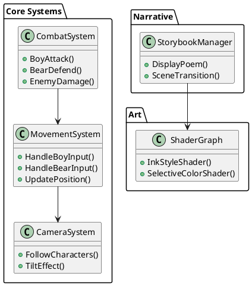

# GGJ25
A project for the Global Game Jam 25

# The boy and bear
The game is inspired by a heartfelt poem about a boy and his teddybear, symbolizing companionship and overcoming loneliness. The gameplay brings this bond to life through cooperative mechanics where the boy and bear must rely on each other to survive an adventurous journey. Set in a melancholic but hopeful world of rain and danger, the player controls both characters, working in tandem to explore, fight enemies, and protect each other.

# Requirements
## Must-Have
* Boy and bear movement controlled independently using an Xbox 360 controller:
  * Right stick: Boy movement
  * Left stick: Bear movement
* Attack and defense mechanics:
  * Right trigger: Boy attacks with a wooden toy sword.
  * Left trigger: Bear defends with a trash can lid shield.
  * Controller remapping feature to swap control sides (optional but important for accessibility).
* A single enemy type representing "dark elements":
  * Simple attack behavior targeting either the boy or the bear.
  * Basic health system for enemies.
* The boy and bear hold hands unless an action (attack or defense) forces them to separate temporarily.
* A basic environment featuring:
  * Rainy weather as described in the poem.
  * Mud and puddles as environmental hazards.

## Should-Have
* Visual and auditory feedback for actions (e.g., boy's sword slash, bear's shield block).
* Animated transitions when the boy and bear interact (e.g., pulling each other along).
* A narrative framework:
  * Transition scenes styled as pages from a storybook.
  * Bold ink lines and selective color accents, such as the boy’s yellow raincoat.
  * Forest background with tall, thin tree silhouettes for a mysterious, whimsical atmosphere.
  * Ending scene at the cottage with the boy's mother calling him back for dinner, echoing the poem.
* Camera and perspective:
  * Tilted top-down view for gameplay, emphasizing clear visibility of the characters and incoming enemies.
  * Dynamic camera following the boy and bear through their journey.

## Could-Have
* Advanced enemy behavior with multiple attack patterns.
* Additional environmental effects, like lightning or dynamic water flow.
* Collectibles or power-ups (e.g., dried patches of ground to rest or recover).

## Won’t-Have
* Large-scale exploration or procedurally generated levels (to stay within jam constraints).
* Complex combat mechanics or combo systems.
* Multiplayer or online functionality.

# Aesthetics
Minimalistic Ink Style: Strong, bold ink lines define the characters, objects, and environment with minimal use of shading or intricate detail.
Subtle Whimsy: Slightly exaggerated features, such as the pointy roof of the cottage or rounded windows, add a playful, storybook charm.
Selective Color: The boy’s raincoat features splashes of yellow to create a focal point, while the rest of the scene remains monochromatic.
Clean Composition: The focus is on simplicity and clear contours, with minimal background details to emphasize the characters and setting.
Atmospheric Forest: The forest in the background is drawn with tall, thin tree silhouettes, adding depth and a subtle sense of mystery.

In the game it should follow the overall aesthetic but the view is a tilted top down emphasizing on a clear view of the boy and bear and incoming enemies. The camera should follow the adventure and the goal is to reach the forest end and make it back to the house cottage where the boys mother is waiting - we should hear the mother calling out her son yelling that the food is ready! indicating that the boy is out on one of his playing adventures

# Method
## Technical Overview
To implement the described adventure game, we will leverage Unity for its flexible 2D/3D capabilities, controller support Key focus areas include:

1. Art Style Implementation: Translating the minimalistic ink style and selective color into Unity.
2. Mechanics: Developing movement, combat, and defense mechanics with Xbox 360 controller support.
3. Narrative Elements: Designing storybook-style transitions and integrating environmental storytelling.
4. Camera: Creating a tilted top-down dynamic camera system.
5. Enemy Behavior: Simple AI for a single enemy type.

## Components and Architecture
1. Art Style
  * 2D Assets:
    * Use bold, hand-drawn ink lines for characters and environment.
    * Texture atlases for the boy, bear, and enemies to maintain a cohesive style.
    * Sprites for rain, mud, puddles, and forest elements.
  * Shader:
    * Custom unlit shader for a flat, monochromatic look.
    * Add a splash of yellow for the boy's raincoat using selective color techniques.
  * Lighting:
    * Minimalistic lighting to maintain the ink-style look.
    * Ambient lighting for atmosphere.
2. Gameplay Mechanics
  * Character Movement:
    * Two Rigidbody2D components (one for the boy, one for the bear).
    * Input mapping for Xbox 360 controller (Unity Input System recommended).
  * Combat and Defense:
    * Attack: Animation trigger for the boy’s sword slash using Animator.
    * Defense: Collision detection for the bear’s shield using Unity’s Physics2D.
  * Controller Remapping:
    * A simple UI in Unity for players to swap input mappings between the boy and bear.
3. Camera System
  * Dynamic orthographic camera following the boy and bear with a slight tilt.
  * Smooth damping for transitions to ensure a fluid feel.
4. Enemy AI
  * Simple finite state machine (FSM):
    * Idle → Chase → Attack cycle.
    * Basic health and damage logic.
  * Spawns at predetermined locations or dynamically.
5. Narrative and Storybook Transition Scenes
  * Storybook transitions:
    * 2D panels rendered as sprites in Unity UI Canvas.
    * Animate text appearing line by line.
    * Background transitions with fading effects.
  * Environment storytelling:
    * Rain audio and visual effects.
    * The mother’s voice-over at the ending.
## Key Systems and Tools
* Unity Input System: For managing Xbox 360 controller support and remapping.
* Animator: To handle character animations.
* Cinemachine: For dynamic camera control.
* Shader Graph: To create the ink-style shading and selective color effects.
* 2D Physics: For combat, movement, and interaction mechanics.
* Audio Mixer: To manage rain sounds, voice-over, and in-game effects.

